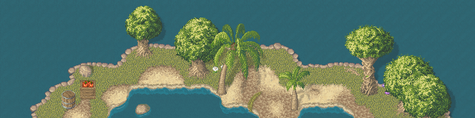
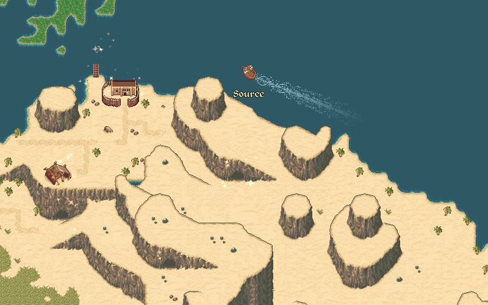
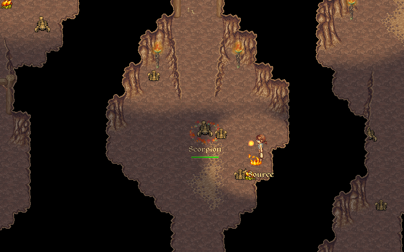
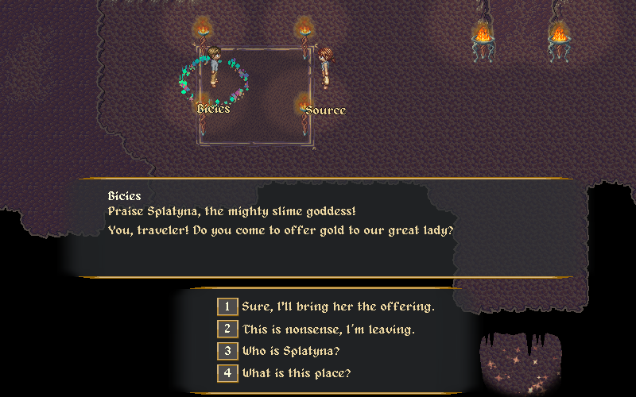

# Source of Mana

**Source of Mana** is a classic 2D MMORPG inspired by the golden era of pixel art RPGs. This game project is truly open source and welcomes contributions from around the globe.

The game is still in early development but already offers a playable solo and multiplayer experience.

## About the Project

**Engine:** Godot 4 (client and server)

**Design Tools:**
- Game editor: The latest [Godot](https://godotengine.org/) version available, currently 4.4.1.
- Level editor: The latest [Tiled](https://www.mapeditor.org/) version available, currently 1.11.2

**Organization:** [Manasource](https://manasource.org)

**Origins:** We are veterans of *The Mana World*, building upon and improving its assets

**Goal:** Become the go-to open source 2D MMORPG project

**Platforms:** Desktop (Windows, macOS, Linux), Mobile (Android) and Web (HTML5/WebAssembly) clients

## Gameplay Highlights

- Explore a fantasy world crafted in charming pixel art
- Interact with NPCs and other players in real-time
- Battle monsters, complete quests, and collect loot
- Dynamic server-authoritative design
- Frequent updates and community-driven development

## Screenshots

## Controls

### General Movement
- **Move:** `WASD`
- **Interact:** `Ctrl`
- **Target:** `E`
- **Untarget:** `Shift`
- **Pickup Items:** `Q`
- **Morph / Transformation:** `M`
- **Sit:** `C`

### Camera
- **Zoom In / Out:** Mouse Scroll
- **Reset Zoom:** Middle Mouse Button
- **Screenshot:** `P`

### UI Shortcuts (Keyboard Only)
- **Open Stats:** `F1`
- **Menu Bar:** `F2`
- **Inventory:** `F3`
- **Skills:** `F4`
- **Quest Progress:** `F5`
- **Minimap:** `F6`
- **Chat:** `F7`
- **Credits:** `F8`
- **Settings:** `F9`
- **Emotes:** `F12`

### Contextual Actions
- **Validate:** `Enter`
- **Cancel / Close:** `Esc`
- **Context Options:** `1`, `2`, `3`, `4`

## Community & Contribution

We’re always looking for contributors of all kinds:
- Pixel artists
- SFX makers
- GDScript or general programmers
- UI/UX designers
- Writers and worldbuilders

If you’re interested in helping, join our community and check out our open issues.

- **Discord:** [Join here](https://discord.com/channels/581622549566193664/1013487216493854780)
- **IRC:** `#sourceofmana` on [Libera.Chat](https://web.libera.chat/#sourceofmana)

## License

For detailed information on the licensing of code, assets, and design, as well as credits for individual asset files, please refer to the [LICENSE.md](LICENSE.md) file.

- **Code License:** MIT License
- **Art & Design License:** CC BY-SA 4.0

---

Source of Mana is developed by volunteers in their free time. If you like retro RPGs & MMORPGs and want to help shape the future of open-source gaming, come say hi!
