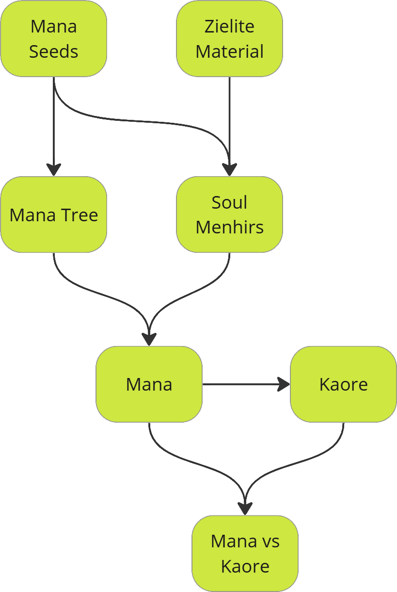

# Lore

## Premises of lore

Mana is a force of life that permeates every living thing. It flows through biomass and grants all living things an interconnected reservoir of energy. Its flow is directed by the deep roots of the Mana Trees, although only one remains alive.

When Mana becomes disconnected from the purifying influence of the Mana Trees, it can stagnate and decay. This energy is known as Kaore. While it fades over long periods of time, it also affects living things in unpredictable ways.

Zielite is a special mineral with an affinity for Mana. It is able to attract, store and radiate Mana energy. Through Zielite, Mana can be manipulated to have specific desired effects. This is called Magic.

The first users of Magic were the Druids, who carved large Zielite stones called Soul Menhirs. These are used to channel large amounts of Mana and allow anyone nearby to practice Magic if they have the knowledge.

##  Mana Seeds

Mana Seeds are both natural tree seeds and powerful sources of pure Mana energy. When planted, they grow deep, intertwining roots that seek out other Mana Seed roots, forming a vast underground network. If enough seeds take root and the soil is untainted, a Mana Tree may emerge.

However, Mana Seeds cannot flourish in corrupted soil. To purify the land, creatures infused with Kaore must either be eliminated or forced away. This can be achieved by activating Soul Menhirs, which radiate pure Mana energy, keeping Kaore-tainted beings at bay. Because of their vital role in restoring balance, Mana Seeds are highly sought after—some see them as a means to heal the world, while others seek to use their energy for personal gain.

## Zielite

Zielite is a rare mineral with a natural affinity for Mana. It can absorb, store, and emit Mana energy, making it invaluable for both magic and protection. Ancient Druids once carved massive Zielite monoliths, known as Soul Menhirs, to regulate Mana flow and create safe havens from the corruption of Kaore.

Though once abundant, Zielite has become scarce due to the Zielite Purge, during which rulers feared its power and sought to control or destroy it. Despite this, remnants of Zielite craftsmanship still exist in hidden talismans, forgotten ruins, and the few remaining Soul Menhirs that continue to stand as bastions against Kaore.

## Mana Tree

Mana Trees are hearts of the world's lifeforce, acting as a natural conductor for Mana energy. In ancient times, there were many, each serving as a stabilizing force, preventing Mana from decaying into Kaore. Now, no known trace of them remains.

A new Mana Tree can only grow if enough Mana Seeds are planted in purified soil. However, with Kaore creatures thriving in corrupted lands, this is a daunting task. Those who seek to restore these Mana Trees must rid the land of Kaore's influence, either through force or by activating Soul Menhirs to drive the creatures away.

## Soul Menhirs

Soul Menhirs are ancient monoliths carved from massive blocks of Zielite, once erected by Druids to channel and radiate Mana. When active, they generate a protective aura, repelling Kaore-infected creatures and stabilizing the land.

Each Soul Menhir contains a central core where a specially attuned orb can be placed. When a Mana Seed is embedded within this core, the menhir reignites, restoring the flow of pure Mana. Over time, entire settlements have formed around active Soul Menhirs, using their energy to ward off Kaore and maintain civilization amidst the world's growing corruption.

In the wake of the Zielite Purge, many Soul Menhirs have been deactivated, their orbs removed or lost. Restoring them has become a critical mission for those who wish to reclaim the world from the creeping decay of Kaore.

## Mana

Mana, often called "lifepower," is the essence of all living things. It flows through the world's biomass, forming an interconnected web of energy. Properly channeled, it can be harnessed to produce magic, heal the land, and sustain life.

Naturally, Mana is directed by the deep roots of the Mana Trees, ensuring its energy remains pure. However, when these trees are destroyed or when Mana is left unregulated, it begins to stagnate and decay, transforming into Kaore.

## Kaore

Kaore is what remains when Mana is severed from its source. Instead of nourishing life, it festers, corrupts, and decays. It seeps into the land, warping living beings into hostile, aggressive forms.

Exposure to Kaore begins with heightened aggression and rage, eventually leading to a complete loss of self. Those fully consumed by Kaore become mindless husks, no longer requiring food, water, or sleep—sustained solely by corruption. Some powerful Druids and dark sorcerers have learned to harness Kaore using Zielite, extending their lives indefinitely. However, this is a dangerous path, as even they must constantly battle against its corrosive influence.

## Mana vs Kaore

Mana and Kaore exist in a constant struggle, with Mana representing life and renewal while Kaore embodies stagnation and decay. In regions where Mana remains strong, the land flourishes, magic is stable, and civilization thrives. However, in Kaore-infested areas, the soil turns barren, the air grows thick with corruption, and once-peaceful creatures become relentless monsters.

The battle between Mana and Kaore is not just a struggle for survival but a choice. Some seek to restore the world by planting Mana Seeds, purifying the land, and reigniting Soul Menhirs. Others embrace Kaore’s power for their own gain, believing that destruction and decay are inevitable.
The future of the world depends on which force prevails.

## Mana & Kaore Synthesis

Other than Seeds and stagnation, Mana and Kaore are known to come into existence in another other way. This is known as Mana/Kaore Synthesis. When life thrives, small quantities of Mana slowly come into existence. Similarly, with death it is Kaore that is generated instead. The exact process is unknown, but this is the main way that Mana and Kaore continued to exist after the death of most Mana Trees. This balance is delicate and the overall flow of Mana is much weaker than in the past when the Trees were still present.

The relationship between Mana, Kaore, Life and Death are a major subject of study at the Manayir Academy.

## Mana & Kaore Storms

These are rare historical events when Mana or Kaore has hit the world in high concentrations from an unknown source. Some think it originated from beyond the sky.

Mana Storms have caused strange times when all living creatures begin to act in unusual ways. Life grows quicker than normal and absurd behaviour becomes common.

Only one Kaore Storm was ever recorded. It wiped all Mana and Kaore from the world and brought about a period of total stagnation and stillness. Afterwards things began to recover, with the two energies slowly reestablishing themselves through births and deaths.