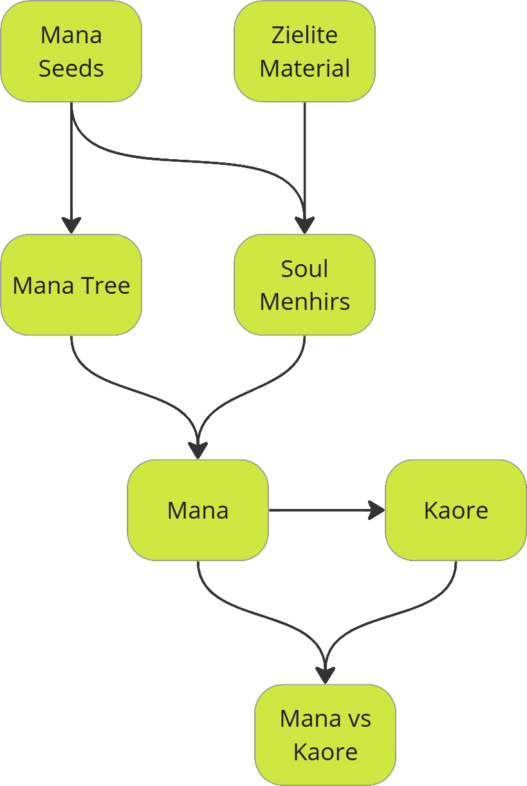

# The World of Aemil

This is the authoritative worldbuilding reference for Aemil. It defines the forces that shape the world, its geography and places, its peoples, its powers and its factions.

The four timeline files hold the detailed history, [Backstory](Backstory.md) covers the recent past that players will hear about most often, and the chapter files describe individual regions as playable content. Where any of those disagree with this document, this document is correct.

## Mana and Kaore

Mana is a force of life that permeates every living thing. It flows through biomass and grants all living things an interconnected reservoir of energy. Its flow was once directed by the deep roots of the Mana Trees, of which none are believed to survive today.

When Mana becomes disconnected from the purifying influence of the Mana Trees, it can stagnate and decay. This energy is known as Kaore. While it fades over long periods of time, it also affects living things in unpredictable ways.

Zielite is a special mineral with an affinity for Mana. It is able to attract, store and radiate Mana energy. Through Zielite, Mana can be manipulated to have specific desired effects. This is called Magic.

The first users of Magic were the Hakuturi, who carved large Zielite stones called Soul Menhirs. These are used to channel large amounts of Mana and allow anyone nearby to practice Magic if they have the knowledge. After the Hakuturi died out, the druids inherited the tradition and have kept it alive ever since.

### Mana

Mana, often called "lifepower," is the essence of all living things. It flows through the world's biomass, forming an interconnected web of energy. Properly channeled, it can be harnessed to produce magic, heal the land, and sustain life.

Naturally, Mana is directed by the deep roots of the Mana Trees, ensuring its energy remains pure. However, when these trees are destroyed or when Mana is left unregulated, it begins to stagnate and decay, transforming into Kaore.

### Kaore

Kaore is what remains when Mana is severed from its source. Instead of nourishing life, it festers, corrupts, and decays. It seeps into the land, warping living beings into hostile, aggressive forms.

Exposure to Kaore begins with heightened aggression and rage, eventually leading to a complete loss of self. Those fully consumed by Kaore become mindless husks, no longer requiring food, water, or sleep—sustained solely by corruption. Some powerful druids and dark sorcerers have learned to harness Kaore using Zielite, extending their lives indefinitely. However, this is a dangerous path, as even they must constantly battle against its corrosive influence. Those who follow it deliberately are the Kahui.

### Mana and Kaore Together

Mana and Kaore exist in a constant struggle, with Mana representing life and renewal while Kaore embodies stagnation and decay. In regions where Mana remains strong, the land flourishes, magic is stable, and civilization thrives. However, in Kaore-infested areas, the soil turns barren, the air grows thick with corruption, and once-peaceful creatures become relentless monsters.

The battle between Mana and Kaore is not just a struggle for survival but a choice. Some seek to restore the world by planting Mana Seeds, purifying the land, and reigniting Soul Menhirs. Others embrace Kaore's power for their own gain, believing that destruction and decay are inevitable.
The future of the world depends on which force prevails.

Other than Seeds and stagnation, Mana and Kaore are known to come into existence in another way. This is known as Mana/Kaore Synthesis. When life thrives, small quantities of Mana slowly come into existence. Similarly, with death it is Kaore that is generated instead. The exact process is unknown, but this is the main way that Mana and Kaore continued to exist after the death of most Mana Trees. This balance is delicate and the overall flow of Mana is much weaker than in the past when the Trees were still present.

The relationship between Mana, Kaore, Life and Death are a major subject of study at the Manayir Order.

### Mana and Kaore Storms

These are rare historical events when Mana or Kaore has hit the world in high concentrations from an unknown source. Some think it originated from beyond the sky.

Mana Storms have caused strange times when all living creatures begin to act in unusual ways. Life grows quicker than normal and absurd behaviour becomes common. Two have been recorded, the first in the Second Era and the second in the Third.

Only one Kaore Storm was ever recorded. Instead of enhancing living creatures as a Mana Storm does, it left them weak and sick, reducing the population of Aemil by almost half within a single year and leaving lasting mutations in some creatures. It ended as abruptly as it began, but left the world holding more Kaore than Mana for the first time in history.

The long Age of Kaore that followed came to its own sudden end in an event known as the Great Stillness, when Kaore collapsed in on itself and emptied the world of both energies. Afterwards things began to recover, with the two energies slowly reestablishing themselves through births and deaths.

### Zielite

Zielite is a rare mineral with a natural affinity for Mana. It can absorb, store, and emit Mana energy, making it invaluable for both magic and protection. The ancient Hakuturi carved massive Zielite monoliths, known as Soul Menhirs, to regulate Mana flow and create safe havens from the corruption of Kaore.

Smaller fragments are worked into Zielite Amulets, which allow the wearer to channel Mana and to bond with a Soul Menhir.

Though once abundant, Zielite has become scarce due to the Zielite Purge, when the Aukati turned society against the use of Mana and rulers across Aemil sought to control or destroy anything capable of channelling it. Despite this, remnants of Zielite craftsmanship still exist in hidden talismans, forgotten ruins, and the few remaining Soul Menhirs that continue to stand as bastions against Kaore.

### Soul Menhirs

Soul Menhirs are ancient monoliths carved from massive blocks of Zielite, first erected by the Hakuturi and later by the druids who inherited their craft, to channel and radiate Mana. When active, they generate a protective aura, repelling Kaore-infected creatures and stabilizing the land.

Each Soul Menhir contains a central core where a specially attuned orb can be placed. When a Mana Seed is embedded within this core, the menhir reignites, restoring the flow of pure Mana. Over time, entire settlements have formed around active Soul Menhirs, using their energy to ward off Kaore and maintain civilization amidst the world's growing corruption.

In the wake of the Zielite Purge, many Soul Menhirs have been deactivated, their orbs removed or lost. Restoring them has become a critical mission for those who wish to reclaim the world from the creeping decay of Kaore.

### Mana Trees (Uru)

Mana Trees are hearts of the world's lifeforce, acting as a natural conductor for Mana energy. In ancient times, there were many, each serving as a stabilizing force, preventing Mana from decaying into Kaore. Today none are known to survive, though one does: the Uru of Poluwat, hidden deep beneath the Tonori Desert and unknown to the world above.

A new Mana Tree can only grow if enough Mana Seeds are planted in purified soil. However, with Kaore creatures thriving in corrupted lands, this is a daunting task. Those who seek to restore these Mana Trees must rid the land of Kaore's influence, either through force or by activating Soul Menhirs to drive the creatures away.

### Mana Seeds (Kano)

Mana Seeds are both natural tree seeds and powerful sources of pure Mana energy. When planted, they grow deep, intertwining roots that seek out other Mana Seed roots, forming a vast underground network. If enough seeds take root and the soil is untainted, a Mana Tree may emerge.

However, Mana Seeds cannot flourish in corrupted soil. To purify the land, creatures infused with Kaore must either be eliminated or forced away. This can be achieved by activating Soul Menhirs, which radiate pure Mana energy, keeping Kaore-tainted beings at bay. Because of their vital role in restoring balance, Mana Seeds are highly sought after—some see them as a means to heal the world, while others seek to use their energy for personal gain.

## Geography

### Continents

#### Ancea

The older of the two continents and the cradle of every land-dwelling race. Humans and Ukar first evolved here, the first cities were founded here, and every great power before the Third Era rose and fell on its soil. It holds the regions of Tonori, Argaes and Kaizei.

#### Aurora

The eastern continent, unreachable until the Great Quake drew the two landmasses closer. Settled from 3E1 onwards by expeditions out of Ancea, it grew wealthy and populous within a century. It holds the regions of Gizor, Heredia and Kolev.

### Regions

#### Tonori

The southern region of Ancea, almost entirely desert. Its vast grasslands turned to sand long ago, though the Zuni still tell stories of the land before. Its capital is Tulimshar, the only large settlement; beyond the city walls the desert belongs to the Zuni tribes.

#### Argaes

The forested heart of Ancea, where the first forest tribes settled and became Humans. Its capital is Hurnscald, and the cliff city of Glaiveald stands in its southeast. The island of Candor lies off its coast.

#### Kaizei

The cold north of Ancea, its mountain passes buried in snow for much of the year. Its capital is Nivalis. Small settlements like Kimarroe survive around its lakes, and nomadic Human and Ukar tribes known as Barbarians still roam beyond them.

#### Heredia

Northern Aurora, the land between Gizor and Kolev, claimed by the Fleet of Heredia after it broke away from Esperia. Its capital is Artis.

#### Gizor

Southern Aurora and the most densely settled part of the continent. Its capital is Esperia, the largest city in the world and the centre of world politics.

#### Kolev

The remaining stretch of Aurora, sparsely populated and never truly settled. Two small settlements exist here and neither serves as a capital.

#### Oranye Isles

A low-lying archipelago far out to sea, and the last Tritan homeland after the Great Quake destroyed the rest. Kyr Ys, mostly submerged and densely populated, is its largest city.

#### Land of Fire

A remote volcanic island in the cold northern seas, settled by adventurous Ukar who adapted over generations into the Kralogs. Thermin is its main settlement.

### Seas and Landmarks

#### Aemilian Sea

The body of water between Ancea and Aurora. Once a vast ocean, two-thirds of it drained into the core of the world during the Great Quake, leaving a smaller sea almost fully enclosed by the two continents.

#### Tritan Ocean

The deep ocean where the first Tritans evolved, in a trench far below the surface. It remains the domain of those Tritans who never came ashore.

#### Tempus Mountains

The great range of Ancea, settled by the mountain tribes who became the Ukar. Tempus Peak, the Ukar capital, is carved into its largest mountain.

#### Sonbral Mountains

A rocky range east of the Tulimshar Valley, outside the Kingdom of Tonori's control and one of the homes of the Zuni.

#### Voile'nolen

A deep inland forest built around its main river, where Tritans settled far from the sea and became the Raijin. The last grove of Uru on Aemil stood here until it was drained during the ritual that ended the Kaore Storm.

## Places

### City-States

#### Artis

Great port city, home of the greatest merchants and artisans. Capital of Heredia, now under the military government of the Legion of Heredia.

#### Esperia

The centre of world politics and largest city in the world. Capital of Gizor and seat of the Gizor Empire.

#### Kyr Ys

Main city of the Tritans and trade hub of the Oranye Isles. It has existed since the First Era and remains the largest underwater city on Aemil.

#### Tulimshar

Second-largest city, the main settlement for most people living in Tonori and great port city. Capital of the Kingdom of Tonori and seat of the Red Queen, whose Red Palace houses her royal court. The city trades for nearly everything it needs; the desert gives it little beyond farmed cactus.

#### Hurnscald

Modest but powerful woodland town, known for being the home of hard-working miners and brave-spirited people. Capital of Argaes and birthplace of the Diamond Company.

#### Glaiveald

Large city within the south of Argaes, it is built on top of a cliff and uses the mountain's cave tunnel as re-enforcement and place of trade/meeting. Founded by refugees from the fall of Keshlam.

#### Nivalis

A great fortress-city providing shelter from the cold in Kaizei. Its port is far from the city because of the seasonal ice sheets.

### Islands

#### Candor

Popular stop for merchant ships travelling along the coast of Argaes, constantly contested between pirates and merchant lords. Its cave system, thought to be warped by an unusual flow of Mana, was once used by the Platinum King to host yearly war games.

#### Drasil

An artificial island built off the coast of Tulimshar by the Diamond Company.

#### Red Corsair Isle

The capital port of the Corsairs, the most powerful group of pirates that controls the Eastern seas. Named after the Red Corsair and her famous crew.

#### Pakoa

Also known as Easter Island, it's a strange disappearing island said to be from a different time and place. When it appears on the horizon it is a sign of good fortune.

### Points of Interest

#### Kaore Salt Caverns

The deep coastal cave system is located near the city of Artis, in the continent of Aurora's northwest. Its environment is said to be unreachable by the roots of the Mana Tree. Kaore, decaying Mana, deposits here over time and promotes the growth of Slimes.

#### Manayir

The great temple-fortress of the Manayir Order, west of Tulimshar past the sandstorm. It is technically a peninsula, but everyone calls it an island because its narrow land bridge was created by magic. Manayir Beach, the stretch of coast leading to it, is the most hospitable ground in the Tonori Desert, green with palms and fed by fresh water.

#### Ruins of Keshlam / Asphodel Moor

The ruins of an ancient large city with a surviving district that is now just a small village.

#### Thermin

Kralog capital city, steam-powered marvel in the volcanic tundra.

#### Crystalline Oasis

A tent-based settlement in the largest oasis of the Tonori Desert, the main village of the first peoples of the desert (Parua's tribe).

#### Kimarroe

Snow village by the lake.

#### Tempus Peak

Ukar capital city, built into the largest mountain of the Tempus range.

#### Modan

The only settlement in the savannah region of Tonori.

#### Sonbral

A Zuni village built partially inside the natural caves of the Sonbral Mountains. Part of the Zuni Confederation, it is their main trading hub and exchanges goods with Tulimshar regularly.

#### Tulimshar Valley

The land south of Tulimshar, a harsh stretch of desert engulfed by a raging sandstorm. Ruined buildings and the remnants of cactus fields are scattered across it, abandoned when the storm arrived.

#### Sandstorm Mines

A semi-natural cave system south of Tulimshar, mined for iron ore until its resources ran out and now abandoned.

#### Poluwat Cave

A hidden chamber at the deepest level of the Sandstorm Mines, its ceiling open to the sky so that moisture and light reach the floor. The last living Mana Tree, the Uru of Poluwat, grows here. Almost no one knows it exists.

#### Snake Pit

A pit in the east of Tonori, just short of the Sonbral Mountains, infested with snakes.

## Peoples of Aemil

Five peoples live on Aemil today. All of them descend from the Tritan line, which spread from the ocean onto the land after the First Event and adapted to wherever it settled. A sixth, the Hakuturi, came before all of them and is entirely unrelated.

### Human

The most numerous people of Aemil, descended from the Tritan forest tribes that settled the lower grounds of Argaes and evolved apart from the sea over a thousand years. Humans founded Keshlam, the Platinum Kingdom, the Republic of Ancea and most of the cities standing today.

The **Zuni** are the earliest Humans to evolve on Ancea, living in the grasslands of Tonori before they became desert. They remain semi-nomadic, keep their own ancient magic, trade with Tulimshar and have never recognised its Kingdom. The **Barbarians** of the far north are nomadic tribes of Humans and Ukar living beyond the reach of any city.

### Ukar

Descended from the Tritan mountain tribes that settled deep in the high rocks of the Tempus Mountains, where they were safe from attack and could mine in abundance. They live in separate independent settlements carved into the mountains, the greatest being Tempus Peak, and are naturally self-contained with little appetite for expansion.

### Tritan

The oldest surviving people, evolved from tadpoles in a deep trench of the Tritan Ocean and exceptionally responsive to Mana. They ruled every water on Aemil during the First Era and built Kyr Ys. The Great Quake destroyed most of their civilisation; those on the Oranye Isles and in a few sheltered bays survived, and the Isles are now their homeland.

### Kralog

Ukar who sailed the cold northern seas and settled the volcanic Land of Fire. Generations of extreme heat and cold, and the First Mana Storm, changed them into a distinctly resilient people. They built Thermin and keep the faith of the Sacred Flame.

### Raijin

Tritans who settled far inland along the main river of Voile'nolen rather than on the coast, and who sheltered the last grove of Uru on Aemil. When their druids attempted a ritual to neutralise the Kaore Storm in 3E334, the mixing energies mutated every one of them: those inside the grove were changed by Mana and became the Light Raijin, and those outside in the wider region were changed by Kaore and became the Dark Raijin.

### Hakuturi (Extinct)

The first sentient creatures of Aemil, and no relation to any people living today — they evolved entirely on Aemil rather than from the Tritan line, and left no known living relatives. They shared traits of both plants and animals in a large humanoid shape, hardy and suited to the wilderness.

The Hakuturi learned to speak with the Uru and adopted their language, forming symbiotic societies in which the trees were revered as mentors and the Hakuturi were seen as guardians of Aemil. They mastered every form of magic and carved the first Soul Menhirs. A plague released by the First Event killed almost all of them, and the last died out during the Age of Landwalkers, leaving their crafts behind them.

## History in Brief

### [First Era: The Mana Era](Timeline - First Era.md)

Aemil is born from Mana and chaos. A seed from the Ether sprouts into the first Uru, the Hakuturi rise and live in harmony with the trees, and the Tritans master magic beneath the waves. It ends when the Tritans' misuse of Mana releases a plague and a surge of Kaore that destroys the Hakuturi and drives the Tritans themselves onto the land.

### [Second Era: The Ancean Era](Timeline - Second Era.md)

Humans and Ukar emerge from the land-dwelling Tritans and found their first cities. The Platinum Kingdom rises and falls, the Republic of Ancea replaces it, and the First Mana Storm gives the sentient races their appetite for expansion. It ends with the Great Quake, which drains two-thirds of the ocean and reshapes the world.

### [Third Era: The Auroran Era](Timeline - Third Era.md)

Aurora is settled, Esperia and Artis are founded, and piracy comes to rule the seas. The Second Mana Storm drives the world into the Mana War, the Aukati rise and the Uru are cut down, and the Kaore Storm halves the population. The Age of Kaore follows: five centuries of conflict, disease and famine.

### [Fourth Era: The Present Age](Timeline - Fourth Era.md)

The Great Stillness ends the Age of Kaore and empties the world of both energies. Mana returns slowly and imperfectly, unable to spread as it once did without the Uru to carry it. This is where the story unfolds, and where the balance can still be restored or lost.

## Nations and Powers

### Kingdom of Tonori

Reconstituted from Tulimshar in 3E480 and ruled today by the Red Queen. It officially follows the Aukati and keeps magic away from its people, though the Soul Menhir at the city gate is tolerated because the city needs it. Its authority barely reaches past the city walls.

### Zuni Confederation

The tribes of Tonori, united in 3E572 against the Kingdom's attempts to subjugate them. They trade freely with Tulimshar and have fought off every expedition sent beyond its walls. Sonbral is their main trading hub.

### Gizor Empire

Founded in 3E336 by the trader Ophieum Barkal, who seized absolute control of Esperia amid the devastation of the Mana War. Its conquests united the Gizor, Heredia and Kolev regions under the Imperial Gizeth banners.

### Legion of Heredia

The mercenary army of the Fleet of Heredia. In 3E793 it took the city of Artis for itself and formed a military government opposed to Mana, Kaore and the use of magic, promising that the Age of Kaore would end if all magic were forbidden.

### Corsair Marque

The syndicate of pirate crews founded on Red Corsair Isle in 3E269, which dominated world trade for over two hundred years and still controls the eastern seas.

### The Free City-States

Hurnscald, Nivalis, Glaiveald, Kyr Ys, Tempus Peak and Thermin govern themselves, bound to each other by trade rather than any crown. Much of Aemil's prosperity passes through them.

### Fallen Powers

The **Platinum Kingdom** (2E201–2E1665) united every Human community on Ancea until the Blue Revolution deposed its last monarch. The **Republic of Ancea** (2E1665–2E1984) replaced it and brought democracy to Aemil before corruption and secession dissolved it. The **Fleet of Heredia** carved out northern Aurora and founded Artis before its own army supplanted it. The **Manayir** ruled Tulimshar throughout the Republic period until they were blamed for the Great Quake and exiled.

## Factions

### Player Factions

#### Legion of Heredia (Warriors)

Access to: Legion HQ, special vendors

The mercenary army of the Fleet of Heredia, which outlived its former masters and eventually took the city of Artis for itself, ruling it as a military government opposed to Mana, Kaore and the use of magic. It remains the most disciplined fighting force on Aemil and still hires out its soldiers across the continent.

#### The Diamond Company (Merchants)

Access to: TDCo. HQ, special vendors

The Diamond Co. was founded in the city of Hurnscald as a mining enterprise and brought great prosperity to the whole region. It eventually grew to acquire mining operations all over the world. Don't be fooled by the name; they don't just mine diamonds!

#### Corsair Marque (Pirates)

Access to: Red Corsair Isle

Being a pirate is much more than having a ship and a crew... There are agreements and codes! Fortunately, you can join the Corsair Marque. A great pirate federation that will help you navigate these perilous waters.

#### Manayir Order (Mages)

Access to: Manayir Tower

The study of Mana is commonplace among the various societies of Aemil, and in many ways it transcends any political conflict among them. The Order is a neutral ground for all and even welcomes students of magic.

### Ideologies

#### Aukati

Status: Large following in both Ancea and Aurora, especially cities.

Worships the god Savea, who is believed to have created Aemil. Strongly opposed to Mana, seeing it as a curse upon Savea's perfect creation.

#### Makutu

Status: Medium to large following throughout Aemil, especially rural areas.

Does not worship any god, but Mana itself. Believing that all things are connected through Mana and that Kaore is its natural byproduct to be controlled as a dangerous resource. The ancient faith of the Hakuturi, passed on first by Mana Trees who would choose people to speak to that would become druids. After the Mana Trees were destroyed the druids continued the traditions and survived in a world hostile to them by proving themselves extremely useful and never directly challenging Aukati political power. A minority faith widely diffused in most areas of Aemil and tolerated due to its long history and historical influence. Controls known Soul Menhirs and the creation of Zielite artefacts.

#### Kahui

Status: Small secretive following, often outlawed.

Sees Kaore as the ultimate form and final process of Mana and seeks to use it to oppose anyone who refused to embrace the corrupting influence of Kaore. It is considered an offshoot of the Makutu Hui and is a commonly rejected minority faith whose followers are often cast out of society.

#### Lady of the Waters

Status: Large following in Oranye Isles, modest following elsewhere.

Worships personified water and water in all its forms including the sea, lakes and rivers. Water is believed to grant life and freedom to each individual. Believers are not bound by many rules and worship tends to be different for every individual or group. Once the only faith of the Tritans, it has also become common among sailors, fishermen and pirates of all races. A minority faith outside the Oranye Isles, where it is the most widely spread.

#### The Sacred Flame

Status: Large following in Land of Fire, very small and sporadic following elsewhere.

Worships fire as the ultimate expression of Mana and Kaore combined. The main faith of the Kralog in the remote Land of Fire.

### Others
