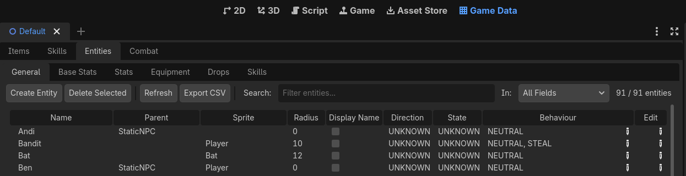
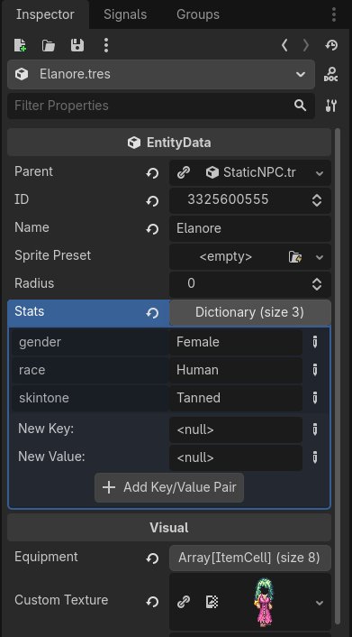
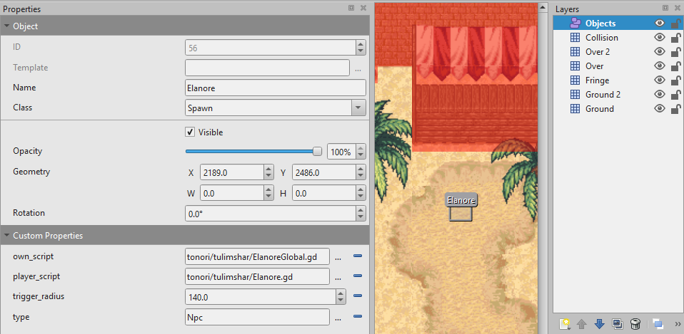

# Adding a quest

This guide walks through everything needed to add a quest to the game, from nothing to a working, playable interaction.

There are five pieces, and they build on each other in this order:

1. **The NPC entity** — the character's data: name, sprite, stats.
2. **The map placement** — where in the world that character stands.
3. **The quest data** — the text shown in the player's quest log.
4. **The progress states** — the list of stages a player can be at in the quest.
5. **The player script** — the actual conversation and quest logic.

Steps 1 and 2 give you a character you can walk up to and talk to. Steps 3 to 5 turn that conversation into a quest. If you only want a chatty villager with no quest attached, you can stop after step 2 and write a two-line script.

Throughout this guide the example is an NPC named `Wend` who gives a quest called "A Simple Errand": fetch his lost straw hat from the market.

## 1. Create the NPC entity

Every character in the game (i.e. NPC, monster, or player) is described by an `EntityData` resource. These live as `.tres` files in `presets/entities/`, and the game scans that whole folder at startup, so **there is no list to register your new file in**. Dropping the file in the folder is enough.

One rule matters more than the rest: the resource's `_id` field must be exactly the hash of its `_name` field. The game uses these hashed numbers instead of strings everywhere for speed, and if the two disagree, loading stops with an assert in `DB.ParseEntitiesDB`. That assert message prints the number you should have used, so if you get it wrong you can copy the correct value straight out of the error.

There are two ways to create the resource.

### Via the Game Data addon (easiest)



1. Open the **Game Data** tab. It sits along the top of the Godot editor next to 2D, 3D, and Script.
2. Click on `Create Entity`, fill the name of that new Entity, validate and select that newly created row.
3. Base stats, Stats and Equipment will help you set the look and some basic behaviours of your NPC.
4. The addon saves a new `.tres` into `presets/entities/` for you, and fills in `_id` with the correct hash automatically. This is the main reason to prefer the addon over creating files by hand.
5. You can then click on `Edit Entity` to open this new entry within the Inspector widget. 

### By duplicating a `.tres` file



1. In the **FileSystem** widget, search for an existing NPC EntityData entry within `presets/entities/`.
2. `Nina` is a good starting point for a plain villager, right click on it, duplicate it and then rename the copy.
3. Double click on that new file and set its name, sprite and stats.

```gdscript
_parent = ExtResource("StaticNPC.tres")   # inherit defaults, keeps the file small
_id = <hash>                              # must be "Wend".hash()
_name = "Wend"
_stats = { "gender": "Male", "race": "Human", "skintone": "Medium" }
_customTexture = <res://data/graphics/sprites/npcs/wend.png>
```

The `_parent` field does more than it looks like it does. It points at another entity resource that acts as a template — `StaticNPC.tres` holds the sensible defaults for an NPC who stands still and does not fight. At load time the game merges the parent into the child (see `EntityData.GetMergedEntity`), with your fields winning wherever they are set. So you only need to write down what makes Wend *different* from a generic static NPC. Everything you leave out is inherited, which keeps these files short and makes it easy to change defaults later in one place.

## 2. Place it in a map (Tiled)

The entity resource says *what* the NPC is. The map says *where* it is. Spawn points are ordinary Tiled objects with specific properties on them, which the `tiled_importer` addon reads when it automatically converts the map after each edits.



Open the map's `.tmx` file in Tiled and do the following.

1. Select the **`Object`** object layer — the yellow one that already holds the map's spawns and warps.
2. Create a new NPC or duplicate an existing NPC object. 
2.1 Duplicate `Ctrl+D` an existing `Spawn` object and place it anywhere you want it to be in the current map.
2.2. Choose the **Insert Rectangle** tool (shortcut `R`) and draw a rectangle where the NPC should appear. The rectangle defines a spawn *zone*, not a single point: the game picks a spot inside it. For a stationary NPC who should always be in the same place, keep the size at 0 width and height since the agent spawns at the rectangle's centre. Larger rectangles are useful for monsters and walking NPCs, which you usually want scattered around an area.
3. With the rectangle still selected, fill in two fields in the **Properties** panel on the left:

   - **Name** — set it to the entity name, `Wend`. This string is hashed and used to look the entity up in `EntitiesDB`, so it must match the `_name` you set in step 1 character for character. A typo here means the spawn silently finds nothing.
   - **Class** — set it to `Spawn`.

4. Still in the Properties panel, add a new **Custom Properties** using the `+ Add Property` button at the bottom. These are the per-spawn settings. Unless the table notes otherwise, create each one as a `string`:

   | Property | Value | Notes |
   |----------|-------|-------|
   | `type` | `Npc` | Required. Tells the game which kind of agent to create. Other valid values are `Monster` and `Player`. |
   | `player_script` | `tonori/tulimshar/Wend.gd` | Path relative to `sources/scripts/`. This is the conversation script, and each player who talks to the NPC gets their own private instance of it. |
   | `own_script` | `tonori/tulimshar/WendGlobal.gd` | Optional. A single shared instance belonging to the NPC itself, used for timers, patrol behaviour, or state that all players see. |
   | `nick` | `Wend the Elder` | Optional. Overrides the name shown above the NPC's head, so the display name can differ from the lookup name. |
   | `direction` | `Down` | Optional. Which way the NPC faces on spawn: `Down`, `Up`, `Left`, `Right`, and so on. |
   | `state` | `Idle` | Optional. The animation state the NPC starts in. |
   | `count` | `20` (int) | Monsters only — how many to spawn in the rectangle. |
   | `respawn_delay` | seconds (float) | Monsters only — how long after death before one comes back. |

5. Save the `.tmx`. When Godot next has focus it re-imports the map through the `tiled_importer` addon and regenerates 3 resources files that are used by the client and the server.
The code that reads these properties and turns them into a `SpawnObject` lives in `tiled_map_reader.gd`, if you ever need to check exactly how a property is interpreted.

> **A spawn object must be a rectangle.** Point objects and polygons are rejected during import, so if your NPC never appears, check the object's shape first.

## 3. Create the quest data

A `QuestData` resource holds the human-readable description of the quest — the summary a player sees in their quest log. It is purely presentational. None of these fields drive any game logic; all of the real behaviour lives in the script you write in step 5.

Quest resources live in `presets/quests/`. Duplicate `NinaHungry.tres` to `SimpleErrand.tres` and fill in the fields:

```gdscript
id = <hash>                 # re-hashed from the name on load
name = "A Simple Errand"
description = "Wend lost his hat in the market. Fetch it."
giver = "Wend"
giverLocation = "Tulimshar Gates"
target = "Straw Hat x1"
targetLocation = "Tulimshar Market"
reward = "50 GP"
```

Unlike entities, the `id` here does not have to be right by hand — the game re-derives it from `name` when the resource loads. The `name` field, on the other hand, does matter, because the next step hashes that exact same string to produce the quest's identifier in code. Keep the two in sync.

## 4. Register progress states

The game needs to remember how far along a quest each player is. That progress is stored as a single number per quest, and this is where you define what those numbers mean.

Open `sources/actor/ProgressCommons.gd` and add three things.

**First, the quest ID.** Add a static variable to the `Quest` class, hashing the same quest name you used in the resource. This is the number that identifies the quest everywhere in code:

```gdscript
class Quest:
    ...
    static var SIMPLE_ERRAND : int = "A Simple Errand".hash()
```

**Second, the state enum.** This lists every stage a player can be at. Two values are fixed by convention and should always be present:

- `INACTIVE = ProgressCommons.UnknownProgress` (which is `0`) is the starting state.
  Every player begins here without anything being written to the database, so it must be the "not started" value.
- The final state is set to `ProgressCommons.CompletedProgress` (which is `255`).
  Helper functions like `IsQuestCompleted()` test for exactly this number, so a quest is only "done" if its last state uses it.

Everything between those two is yours to name. Values are assigned automatically in order, so you can add as many intermediate steps as the quest needs:

```gdscript
enum SIMPLE_ERRAND
{
    INACTIVE = ProgressCommons.UnknownProgress,
    STARTED,
    REWARDS_WITHDREW = ProgressCommons.CompletedProgress,
}
```

**Third, the lookup entry.** This connects the ID to the enum so the rest of the game can find your states by quest ID:

```gdscript
static var QuestStates : Dictionary[int, Variant] = {
    ...
    Quest.SIMPLE_ERRAND: SIMPLE_ERRAND,
}
```

If you forget this last entry the quest still compiles and mostly works, but any code that looks states up by name will quietly fall back to `UnknownProgress`.

## 5. Write the player script

This is where the quest actually happens. Create `sources/scripts/tonori/tulimshar/Wend.gd` — the path you put in the `player_script` property back in step 2 — and extend `NpcScript`.

`OnStart()` is the entry point: it runs when a player interacts with the NPC.
Inside it you describe the conversation using calls like `Mes` (say a line) and `Choice` (offer the player an option).

The simplest possible NPC just says one thing:

```gdscript
extends NpcScript

func OnStart():
    Mes("Hello there.")
```

A quest NPC does the same, but checks the player's progress first and branches on it. This is the pattern to copy:

```gdscript
extends NpcScript

const QUEST : int = ProgressCommons.Quest.SIMPLE_ERRAND

func OnStart():
    match GetQuest(QUEST):
        ProgressCommons.SIMPLE_ERRAND.INACTIVE:
            OnIntro()
        ProgressCommons.SIMPLE_ERRAND.STARTED:
            OnCheck()
        _:
            Mes("Thanks again for the hat!")

func OnIntro():
    Mes("I lost my straw hat in the market. Could you fetch it?")
    Choice("Sure.", OnAccept)
    Choice("Not now.", Farewell)

func OnAccept():
    Mes("Bless you. It's near the bakery stand.")
    SetQuest(QUEST, ProgressCommons.SIMPLE_ERRAND.STARTED)

func OnCheck():
    if HasItem(DB.GetCellHash("Straw Hat")):
        Mes("My hat! You found it!")
        RemoveItem(DB.GetCellHash("Straw Hat"))
        SetQuest(QUEST, ProgressCommons.SIMPLE_ERRAND.REWARDS_WITHDREW)
        AddGP(50)
    else:
        Mes("Still by the bakery stand, I think.")
```

Reading that top to bottom: a player who has never spoken to Wend is at `INACTIVE`, so they get the pitch and a choice. Accepting moves them to `STARTED`, which is saved to their character. Coming back while `STARTED`, they hit `OnCheck()`, which either takes the hat and pays out, or nudges them back to the market. Once they are at `REWARDS_WITHDREW` neither of the first two cases match, so the `_` catch-all gives them a friendly line forever after.

The catch-all case matters more than it looks: it covers every state you have not explicitly handled, including any you add later. Without it, an unhandled state means the NPC says nothing at all.

It is recommended to duplicate an existing NPC script to re-use the existing function structure and prevent any typos.

### Handy `NpcScript` calls

These are the functions available inside your script. All of them assume there is a player involved, so they only work from a `player_script`, not a global one.

- **Dialogue:** `Mes` (speak), `Think` (thought bubble), `Narrate` (unattributed narration), `Choice(text, callable)`, `Farewell` and `Greeting` (random polite lines).
- **Quest:** `GetQuest(id)`, `SetQuest(id, state)`, `IsQuestStarted(id)`, `IsQuestCompleted(id)`.
- **Inventory:** `HasItem`, `AddItem`, `RemoveItem`. Items are identified by hash, so wrap the name: `DB.GetCellHash("Straw Hat")`.
- **Rewards:** `AddGP` (money), `AddExp`, `TeachSkill`, `AddKarma`.
- **Warp and UI:** `Warp`, `HighlightUI`, `OpenUI`, `DisplayTracker`.

### One thing that surprises people: dialogue is queued

Your script does **not** run line by line as the player reads. When `OnStart()` is called it runs all the way through immediately, and every `Mes` and `Choice` appends an entry to a queue. The dialogue window then plays that queue back as the player clicks forward.

The same applies to the action calls. `SetQuest`, `AddItem`, `AddGP` and friends all wrap themselves in `Action(callable)`, which means they are queued in position rather than executed the instant you call them. In practice this does what you want — a reward written after the "you found it!" line lands after the player reads that line — but it explains why you cannot read back a value you just set earlier in the same function. If you need to branch on something you changed, do the change in one callback and the branching in the next.
